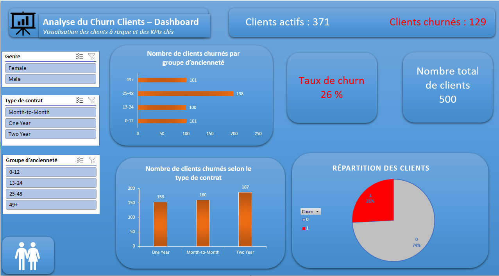

# 📊 Analyse du Churn Clients

Projet portfolio réalisé avec **Excel** (Power Query, Tableaux Croisés Dynamiques, Dashboard interactif).  
Objectif : analyser le **churn clients** (perte de clients), identifier les profils à risque et proposer des recommandations pour améliorer la fidélisation.

---

## 📂 Contenu du projet

- **dataset.xlsx** → données brutes des clients (500 lignes : sexe, ancienneté, type de contrat, montant mensuel, etc.)
- **dashboard.xlsx** → dashboard interactif avec KPIs, graphiques et slicers
- **dashboard_preview.png** → aperçu du dashboard

---

## 🎯 Objectifs du projet

- Comprendre **qui quitte l’entreprise et pourquoi**
- Identifier les facteurs clés du churn (ancienneté, type de contrat, montant payé…)
- Construire un **dashboard interactif** pour suivre le churn en temps réel
- Fournir des recommandations pour améliorer la rétention client

---

## 🔎 Démarche

1. **Nettoyage des données** avec Power Query  
   - Suppression des doublons  
   - Correction des valeurs incohérentes  
   - Création de nouvelles colonnes (ex : revenu moyen par mois, groupe d’ancienneté)

2. **Calcul des KPIs principaux** avec Tableau Croisé Dynamique  
   - Clients actifs : **371**  
   - Clients churnés : **129**  
   - Taux de churn : **25,8 %**  
   - Total clients : **500**

3. **Visualisation interactive**  
   - Slicers (genre, type de contrat, ancienneté)  
   - Graphiques :  
     - Répartition Churn vs Non-Churn  
     - Churn par ancienneté  
     - Churn par type de contrat  

---

## 📈 Résultats clés

- Environ **1 client sur 4 quitte l’entreprise** (25,8 %)  
- Les clients **Month-to-Month** et ceux avec **moins de 12 mois d’ancienneté** sont les plus à risque  
- Les clients sous **contrats longue durée** restent beaucoup plus fidèles  
- Certains churners ont un **revenu mensuel élevé**, ce qui représente une perte importante  

---

## ✅ Recommandations

1. Prioriser la rétention des **nouveaux clients** et **Month-to-Month**  
2. Mettre en place des **offres personnalisées** pour les clients à forte valeur  
3. Développer des **programmes de fidélisation** pour les clients fidèles ou sous contrats longs  
4. **Surveiller régulièrement le churn** via le dashboard Excel pour anticiper les risques  

---

## 🖼️ Aperçu du Dashboard

---

## 💡 En résumé

- Transformation de données brutes en **KPIs clairs et exploitables**  
- Création d’un **dashboard interactif et simple d’utilisation**  
- Mise en évidence d’**insights concrets** pour aider à la prise de décision  
- Projet démontrant mes compétences en **Excel, Power Query, analyse et data storytelling**  
